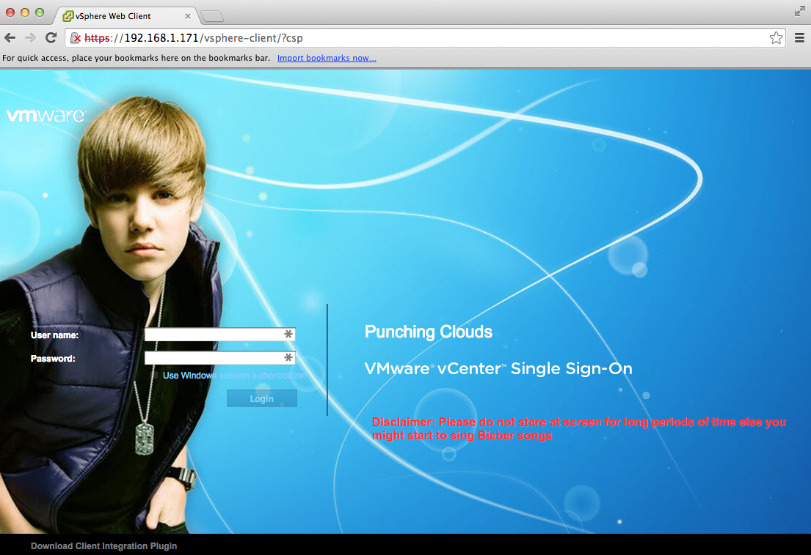
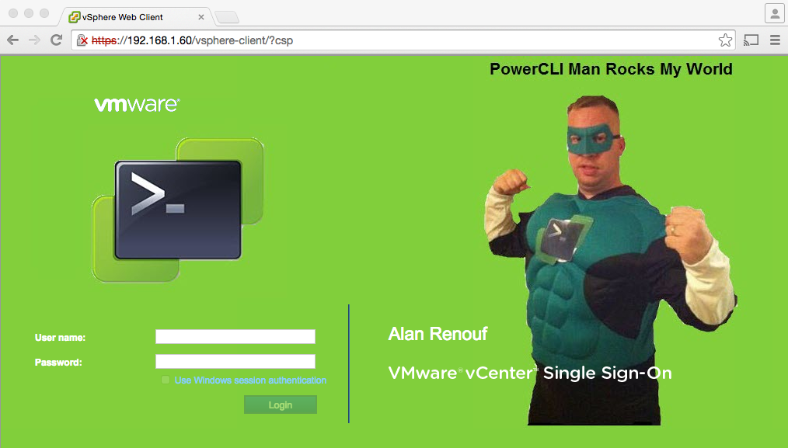
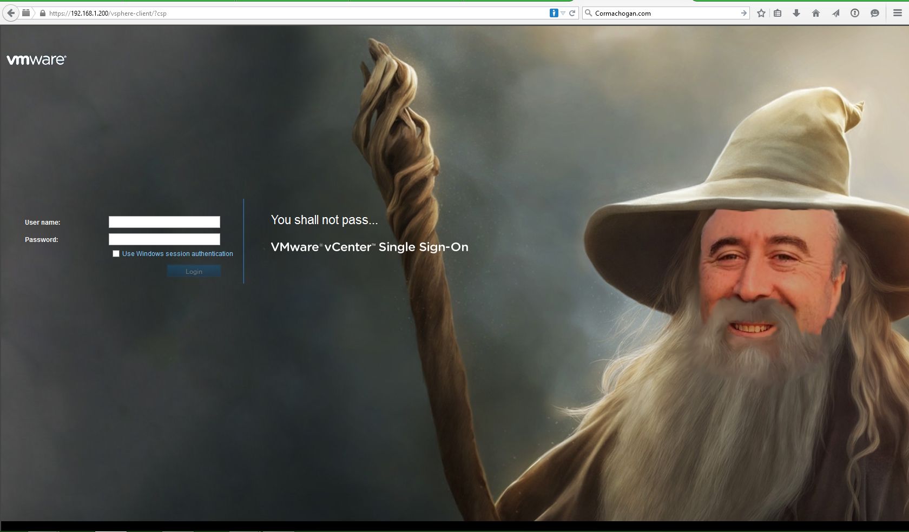

# Customize the vSphere Web Client 6.0 Login UI

In vSphere 6.0, the vCenter Single Sign-On login page is now written using regular HTML and CSS. This means you can actually now customize the login page with your own logos, colors or text that you wish to display to your end users. Not only can you customize the login for vCenter Server but you can also do the same for vRealize Automation Center as long as you are using the latest version of the Platform Services Controller which now provides other services in addition to vCenter Single Sign-On.

## Requirements

* Running vSphere 6.0
* vCenter Server with Platform Services Controller (Embedded or External)

## Configurations

There are two specific files that you will want to take a look at, the first is **unpentry.jsp** which controls the look and feel of the actual login page and the second is **login.css** which controls the stylesheet for the login page. If you wish to include your own images including gifs (which I did not expect would work), there is a img directory that you can reference. Below are the paths to these configuration files for both a Windows vCenter Server and the VCSA 6.0.

**Windows vCenter Server 6.0**

    C:\ProgramData\VMware\vCenterServer\runtime\VMwareSTSService\webapps\websso\WEB-INF\views
    C:\ProgramData\VMware\vCenterServer\runtime\VMwareSTSService\webapps\websso\resources\css
    C:\ProgramData\VMware\vCenterServer\runtime\VMwareSTSService\webapps\websso\resources\img

**VCSA 6.0**

    /usr/lib/vmware-sso/vmware-sts/webapps/websso/WEB-INF/views/unpentry.jsp
    /usr/lib/vmware-sso/vmware-sts/webapps/websso/resources/css/login.css
    /usr/lib/vmware-sso/vmware-sts/webapps/websso/resources/img

## Contributing

When you create a great looking theme be sure to create a pull request and add your changes back here.  When creating your own example please include a sample.png or sample.gif file in the folder for others to view.

## Examples

**Rawlinson Rivera Theme**

**Duncan Epping theme**

**Alan Renouf Theme**

**Mike Foley Theme**

**CaptainVSAN Theme**

**Inception Theme**

**Cormac Hogan Theme**

